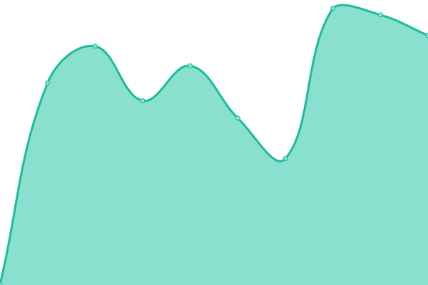

# [📈 Live Status](https://status.grahamsh.com): <!--live status--> **🟩 All systems operational**

This repository contains the open-source uptime monitor and status page for [GrahamSH](https://grahamsh.com), powered by [Upptime](https://github.com/upptime/upptime).

With [Upptime](https://upptime.js.org), you can get your own unlimited and free uptime monitor and status page, powered entirely by a GitHub repository. We use [Issues](https://github.com/grahamsh-llk/status/issues) as incident reports, [Actions](https://github.com/grahamsh-llk/status/actions) as uptime monitors, and [Pages](https://status.grahamsh.com) for the status page.

<!--start: status pages-->
<!-- This summary is generated by Upptime (https://github.com/upptime/upptime) -->
<!-- Do not edit this manually, your changes will be overwritten -->
<!-- prettier-ignore -->
| URL | Status | History | Response Time | Uptime |
| --- | ------ | ------- | ------------- | ------ |
|  [GrahamSH.com](https://grahamsh.com) | 🟩 Up | [graham-sh-com.yml](https://github.com/GrahamSH-LLK/status/commits/HEAD/history/graham-sh-com.yml) | 

 239ms
     
 | 

<a href="https://status.grahamsh.com/history/graham-sh-com">100.00%</a>
    

|  [FRCTools](https://frctools.com) | 🟩 Up | [frc-tools.yml](https://github.com/GrahamSH-LLK/status/commits/HEAD/history/frc-tools.yml) | 

 924ms
     
 | 

<a href="https://status.grahamsh.com/history/frc-tools">100.00%</a>
    

|  [FRCTools Orders](https://orders.frctools.com) | 🟩 Up | [frc-tools-orders.yml](https://github.com/GrahamSH-LLK/status/commits/HEAD/history/frc-tools-orders.yml) | 

 106ms
     
 | 

<a href="https://status.grahamsh.com/history/frc-tools-orders">100.00%</a>
    

<!--end: status pages-->

[**Visit our status website →**](https://status.grahamsh.com)

## 📄 License

- Powered by: [Upptime](https://github.com/upptime/upptime)
- Code: [MIT](./LICENSE) © [GrahamSH](https://grahamsh.com)
- Data in the `./history` directory: [Open Database License](https://opendatacommons.org/licenses/odbl/1-0/)
